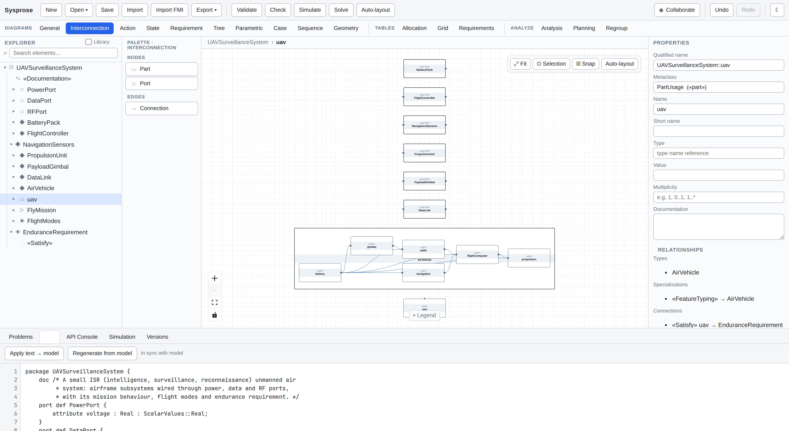

# Sysprose

**Another system modeler** — models as prose, tested by agents in the browser. Sysprose is a
pure-browser modeling tool: author systems graphically *and* as textual definitions, validate,
analyze, simulate and automate, all client-side with **no backend required**. It exposes a
programmable **API for data analysis and automation**, with an in-browser TypeScript SDK and an
OMG SysML v2 *API & Services*–shaped query facade.

[](https://cosmindxu.github.io/sysprose/)

<p align="center"><em>An ISR unmanned air system modelled in Sysprose — the interconnection view of
the air vehicle, generated from the textual definitions shown underneath
(<a href="examples/uav-isr.sysml"><code>examples/uav-isr.sysml</code></a>).
<strong><a href="https://cosmindxu.github.io/sysprose/">Try it in your browser →</a></strong></em></p>

> **AI-agent focus.** Two things make the tool agent-friendly: models are developed as *textual
> definitions* an agent can write and diff like code, and the whole app is exercised through the
> browser, so an agent can drive and test it end-to-end with a browser-automation harness (see
> the Playwright suite in `test/e2e/`).

> An academic modeling tool targeting the core authoring experience of modern MBSE
> tools, built on the OMG SysML v2 / KerML standard (adopted 2025).

## Name and standards status

Sysprose implements a **SysML v2–style textual notation** and an **OMG-API-shaped element
graph**, and it is a **candidate implementation only**: it is *not* a certified or conformance-
tested SysML v2 tool, and it does not claim conformance to any OMG specification. **SysML® is a
registered trademark of the Object Management Group, Inc.** This project is not affiliated with,
sponsored by, or endorsed by the OMG. Where the documentation says "SysML v2" it refers to the
*language and API shape being implemented*, never to a certification of this tool.

## Highlights

- **Standards-native model** — the in-memory model mirrors the OMG API element-graph (flat `@id`/`@type`, relationships reified as first-class elements), so it round-trips losslessly.
- **Graphical + textual** — multiple diagram views (General/BDD, Interconnection/IBD, Action, State, Requirement, Tree) kept in sync with the SysML v2 textual notation.
- **Validation** — a rule engine flags naming, typing, multiplicity, containment and traceability issues.
- **API-first** — query the model with OMG-shaped constraint trees, compute analytics (metrics, requirement-satisfaction coverage, traceability, where-used), and script automations.
- **Local-first** — projects persist in the browser (IndexedDB/localStorage); import/export `.sysml`, model JSON, and OMG element-graph JSON.

## For AI agents

Sysprose is built to be driven by an agent that authors models as **textual
definitions** and repairs them from the tool's own feedback.

```bash
npm run check -- model.sysml --json     # exit 0 clean · 1 findings · 2 usage/IO
```

Every finding carries a **stable code**, an exact **source range** (line, column
and offset, start and end), and a one-line **hint** naming the repair; parser
errors also carry `expected` and `found`. Branch on `code`, never on `message`.

```jsonc
{
  "code": "validation/duplicate-name",
  "severity": "error",
  "range": { "start": { "line": 3, "column": 5, "offset": 32 }, "end": { … } },
  "elementName": "A",
  "hint": "Rename one of them, or move it to a different owner. Sibling names must be unique."
}
```

The loop is: write the file, check it, go to `range.start`, apply `hint`, repeat
until `ok`. In TypeScript, `checkText(source)` from `@text/index` does the same
thing in-process and never throws.

- [`docs/DIAGNOSTIC-CODES.md`](docs/DIAGNOSTIC-CODES.md) — every code, what
  triggers it, and the repair it suggests.
- [`docs/AGENT-AUTHORING-CAMPAIGN.md`](docs/AGENT-AUTHORING-CAMPAIGN.md) — the test
  campaign that keeps this feedback good enough to act on, and the open defects
  it has found.

## Architecture

See [`docs/03-architecture-and-plan.md`](docs/03-architecture-and-plan.md). Layered, dependency-acyclic TypeScript modules:

| Module | Path | Responsibility |
|--------|------|----------------|
| Core | `src/core` | Metamodel + `Model` graph (CRUD, traversal, events, JSON) |
| Text | `src/text` | SysML v2 textual notation parser + serializer |
| Validation | `src/validation` | Rule-based model checker |
| API | `src/api` | In-browser SDK + OMG Query facade + analytics |
| Diagram | `src/diagram` | Model→diagram mapping, elkjs auto-layout, React Flow renderers |
| Persistence | `src/persistence` | Project store + import/export |
| UI | `src/ui` | React app: explorer, canvas, palette, properties, text editor |

## Reference docs

- [`docs/01-state-of-the-art.md`](docs/01-state-of-the-art.md) — survey of existing SysML v2 tools.
- [`docs/02-omg-standard-reference.md`](docs/02-omg-standard-reference.md) — OMG SysML v2 / KerML / API & Services implementer reference.
- [`docs/03-architecture-and-plan.md`](docs/03-architecture-and-plan.md) — architecture & build plan.
- [`docs/TEST-REPORT.md`](docs/TEST-REPORT.md) — feature-coverage test report (generated).

## Develop

> Node 22. The optional corpus-conformance tests read a local checkout of the OMG `sysml.library` from `~/.stdlib-src` (override with `SYSML_CORPUS_ROOT`) and skip when it is absent.
>
> Maintainer note: if your checkout sits on a VirtualBox shared folder, keep `node_modules` on the guest filesystem and use `vite build` + `vite preview` — vboxsf breaks the dev server's file-watching.

```bash
npm install
npm run typecheck      # tsc --noEmit
npm test               # vitest unit/integration
npm run build && npm run preview   # serve the app at :4173
npm run test:e2e       # Playwright E2E (after preview is up)
npm run report         # regenerate docs/TEST-SUMMARY.md
npm run campaign       # the agent authoring testing campaign
npm run codes          # regenerate docs/DIAGNOSTIC-CODES.md from the catalogue
npm run check -- <file.sysml> [--json]   # check a file from the command line
```

## Deploy

Sysprose is a pure static SPA — no backend needed. `vite.config.ts` uses `base: './'`, so the build runs on any host path.

- **GitHub Pages:** enable Pages (Settings → Pages → GitHub Actions); `.github/workflows/deploy-pages.yml` builds and deploys on push to `main`.
- **Any static host:** `npm run build` → serve `dist/` (Netlify, S3, nginx, `python -m http.server`, …).
- **Optional OMG API server (REST + OSLC):** `npm run serve`, or containerized:
  ```bash
  docker build -t sysprose-api . && docker run -p 5178:5178 sysprose-api   # OpenAPI at :5178/openapi.json
  ```
  Auth is **off by default** (local-first, bind loopback). Before exposing it, set `SYSML_API_TOKEN=<secret>` to require `Authorization: Bearer <secret>` on every request (`GET /health` stays open); a strict `Content-Security-Policy` is always sent, and `CORS_ORIGINS` restricts the browser allowlist.
- **Optional collaboration relay (real-time editing via Yjs):** `npm run collab` starts a WebSocket relay (default `ws://127.0.0.1:1234`). It binds loopback-only by default (`HOST`); set an Origin allowlist with `COLLAB_ALLOW_ORIGIN`, a shared secret with `COLLAB_TOKEN=<secret>` (clients then connect with `?token=<secret>`), and bound load with `COLLAB_MAX_ROOMS` (default 512) / `COLLAB_MAX_CONNS_PER_ROOM` (default 256) before exposing it.

## License

MIT — except the bundled OMG standard library under `src/library/std/` (EPL-2.0, attributed; see `docs/LICENSES.md`).
