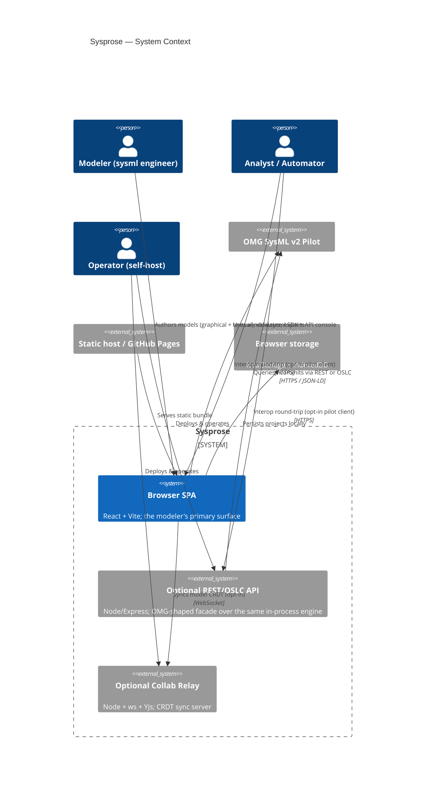

# 01 — System Context (C4 Level 1)

Sysprose is a **standards-native, local-first modeling tool** whose
primary delivery is a single-page browser application. An optional HTTP API and
a collaboration relay can be deployed alongside it, but neither is required for
the core authoring experience.

## Context diagram

## Actors

| Actor | Goal | Surface used |
|-------|------|--------------|
| **Modeler** | Graphical + textual SysML v2 authoring with validation and export | Browser SPA |
| **Analyst / Automator** | Scripted analysis & automation; data extraction | `window.sysml` SDK, in-app API console, optional REST/OSLC API |
| **Operator** | Self-host the API and/or collab relay | Docker / Node |

## External systems

| System | Relationship | Notes |
|--------|--------------|-------|
| **Static host / GitHub Pages** | Serves the SPA bundle | `vite.config.ts` uses `base: './'` so it runs on any path |
| **Browser storage** | Persistence backend | `localStorage` (small projects) + `IndexedDB` (default). Same-origin only |
| **OMG SysML v2 Pilot** | Opt-in interoperability target | `src/interop/pilot-client.ts`; used by `npm run interop` |
| **Collab Relay** | Opt-in CRDT sync | `scripts/collab-server.ts`; Yjs over WebSocket |

## Key invariants

1. **Serverless by default.** The browser app talks to the *in-process*
   `SysmlApiServer` / `OslcServer` facades directly (`src/ui/store.ts:537`). The
   HTTP server is a thin translation layer over those same facades
   (`src/server/app.ts:141-168`).
2. **Standards-native model.** The in-memory `Model` mirrors the OMG SysML v2
   API element-graph (flat `@id`/`@type`, relationships reified as first-class
   elements). See `02`/`03` for the metamodel shape.
3. **Local-first.** All persistent state lives in the browser; projects,
   undo/redo history, and (when enabled) the CRDT doc.
