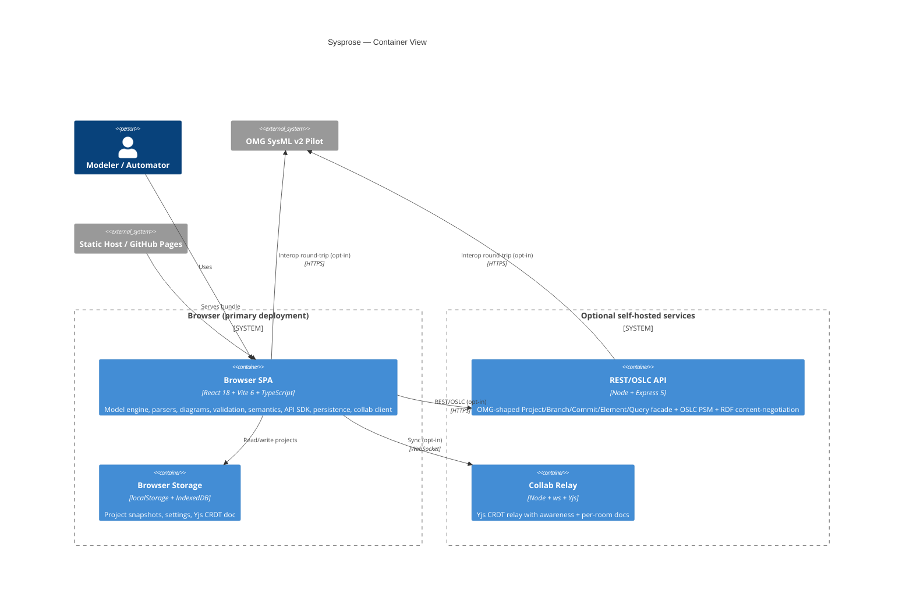

# 02 — Container View (C4 Level 2)

Three independently deployable containers exist. **Only the Browser SPA is
required**; the REST API and Collab Relay are optional and self-hosted.

## Container diagram

## Container responsibilities

### Browser SPA (`src/`, `dist/`)
- **Tech:** React 18, Vite 6, TypeScript 5.7, ES2022, `@xyflow/react` (React
  Flow), `elkjs` (layout), `three` (lazy, 3D geometry view only), `yjs` +
  `y-websocket` + `y-indexeddb` (collab), `zustand` (state).
- **Holds the entire engine in-process:** metamodel + `Model` graph
  (`core/`), textual parser + serializer (`text/`), validation rule engine
  (`validation/`), KerML semantics (`semantics/`), OMG API/SDK/Query/analytics
  (`api/`), diagram builders + renderers (`diagram/`), persistence
  (`persistence/`), UI (`ui/`), and the collab client (`collab/`).
- **Exposed automation surface:** `window.sysml` (`src/ui/App.tsx:40`) — the
  `ModelApi` SDK, equivalent in power to DevTools, intentionally unsandboxed.

### REST / OSLC API (`src/server/`, `Dockerfile`)
- **Tech:** Node + Express 5. CORS `*` by design (`src/server/app.ts:76`).
- **Single-delegation pattern:** every OMG REST route is mounted under
  `/api/*` and translated into an in-process `api.apiFetch(verb, rel, body)`
  call (`src/server/app.ts:141-168`); OSLC routes under `/oslc/*` go to
  `oslc.oslcFetch(...)` (`src/server/app.ts:105-116`). Also exposes
  `/health`, `/openapi.json`, `/docs`.
- **Optimistic concurrency:** per-project write queue + `If-Match`/`ETag`
  (`src/server/app.ts:223-333`).
- **RDF content negotiation:** Turtle / RDF-XML / JSON-LD via `Accept` or
  `?format=` (`src/server/app.ts:111-115`, `src/server/rdf.ts`).

### Collab Relay (`scripts/collab-server.ts`)
- **Tech:** Node + `ws` + Yjs (`WSSharedDoc`). Rooms derived from the URL
  path; each room holds one `Y.Doc` with `elements`/`metadata` maps.
- **Broadcast:** update + awareness messages relayed to all peers in a room
  (`scripts/collab-server.ts:67-77`).
- **Lifecycle:** a room's doc is destroyed when its last connection closes
  (`:111-115`).

## Data stores & formats

| Store / Format | Used for | Owner |
|----------------|----------|-------|
| `localStorage` | Small-project fallback (`LocalStorageStore`) | Browser SPA |
| `IndexedDB` | Default project store (`IndexedDBStore`); also `y-indexeddb` for the CRDT | Browser SPA |
| `.sysml` (text) | Import/export — SysML v2 textual notation | `text/` |
| Model JSON | Import/export — serialized `Model` | `core/` + `persistence/io.ts` |
| OMG element-graph JSON | Import/export — flat `@id`/`@type` graph | `api/` + `persistence/io.ts` |
| RDF (Turtle/RDF-XML/JSON-LD) | OSLC linked-data projection | `server/rdf.ts` |

## Boundaries the code enforces

- `test/server/index-browser-guard.test.ts` forbids any file outside
  `src/server/` from importing `express` or matching `/(^|\/)server(\/|$)/`.
- The collab barrel (`src/collab/index.ts`) deliberately re-exports nothing
  that pulls `ws` or the server-side relay code, so the browser bundle stays
  clean.
- The Three.js renderer (`Geometry3DView.tsx`) is **lazy** via dynamic
  `import()` from `src/ui/panels/CenterPanel.tsx:31`; the `diagram` barrel
  refuses to re-export it (`src/diagram/index.ts:29-32`).

## Boundaries the code does NOT enforce (see `08-adversarial-review.md`)

- No guard prevents `yjs`, `three`, or `elkjs` from being mis-bundled into the
  wrong chunk (only `express` is guarded).
- No guard enforces "siblings via their public `index.ts`" — deep-imports into
  sibling internals exist in ~11 production sites (`08 §A`).
- Baseline hardening headers are set on the API (`nosniff`/`DENY`/`no-referrer`),
  but no CSP and **no auth** on either the API or the relay; both bind loopback by
  default, and the relay adds an Origin allowlist + payload/room caps.
