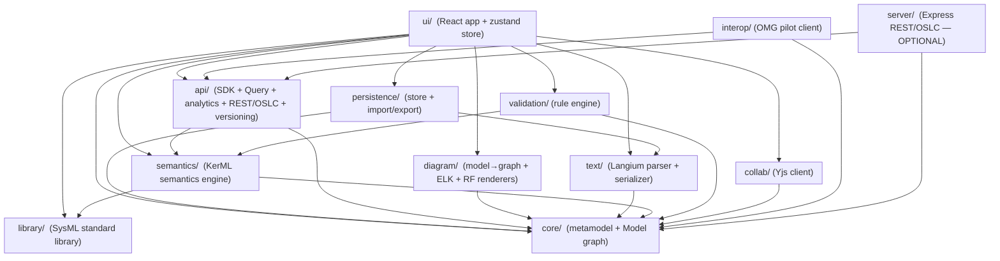

# 03 — Component View (C4 Level 3)

The Browser SPA container decomposes into **12 source modules** under `src/`.
This page lists each module's responsibility, public surface (its `index.ts`),
and direct dependencies. **Every file count below is `.ts` + `.tsx` under the
module, subdirectories included, re-measured 2026-09-09** — the figures had drifted
by as much as a factor of two while the counting rule was left unstated, which is
how `ui/` came to read "12 files" for a tree holding 28. The *documented* layering (from
`03-architecture-and-plan.md` §4) is compared with the *actual* import graph in
[`04-dependency-graph.md`](./04-dependency-graph.md).

## Module map

**Legend:** green = module in the original plan (`03-architecture-and-plan.md`
§4); orange = module added since the plan was written (the "scope drift" set;
see `04`).

## Per-module detail

### `core/` — the contract (9 files)
**Responsibility:** the in-memory SysML v2 model: `ElementRecord` (uniform
node/relationship), `Model` (CRUD, containment index, change events, JSON
round-trip), `ModelFactory`, metaclass catalogues & predicates, id generation.
**Public surface** (`src/core/index.ts`): `Model`, `FORMAT_VERSION`,
`ChangeEvent`, `ModelFactory`, `buildSampleModel`, full metamodel re-export,
`ids`.
**Depends on:** nothing (pure TS, uses `globalThis.crypto` /
`globalThis.structuredClone`).

### `text/` — textual notation (14 files: 6 hand-written + the generated Langium output)
**Responsibility:** bidirectional conversion between SysML v2 textual notation
and the `Model`.
**Live parser:** Langium grammar (`src/text/langium/sysml.langium`) → generated
AST → `astToModel` mapper (`src/text/langium/map-to-model.ts`), exported as
`parseModel` (`src/text/index.ts:18`).
**Forward-ref pass:** `Mapper.resolveDeferredRefs()` runs once at the end of the
build (finding F4) to re-resolve references whose target was declared later or in
a sibling scope — endpoints (`sourceRef`/`targetRef`), `aliasFor`, and node-level
specialization arrays; it deliberately EXCLUDES `typeRef`/`attrs.type`, which
remain `library/`'s `resolveTypeReferences` responsibility.
**Dead parsers** (kept but unused at runtime): `src/text/parser.ts` (only its
*types* are re-exported) and `src/text/parser-legacy.ts`. ~2.1 k LOC of dead
code — see `08 §G`.
**Public surface:** `parseModel`/`parse`/`serializeModel`/`serialize`/
`serializeElement`, `lex`, `ParseResult`/`ParseDiagnostic`.

### `validation/` — rule engine (5 files)
**Responsibility:** rule-based model checker producing `Diagnostic[]`.
**Public surface:** `validate(model)`, `RULES` registry, `Diagnostic` type.
**Actual deps:** `core`, plus `semantics` (for type/conformance checks) —
**undeclared in the plan**.

### `api/` — SDK + Query + analytics + REST/OSLC + versioning (12 files)
**Responsibility:** three surfaces over one implementation — `ModelApi` (TS
SDK), OMG-API-shaped `QueryEngine`, pure analytics functions, and the
in-process OMG REST/OSLC facade.
**Inbound validation** (`request-schemas.ts`): `ajv` body validators
(`validateRequestBody`) that every mutating `rest.ts` handler runs on `req.body`,
returning `400` on a present-but-malformed body (finding H1). Internal to
`rest.ts` — not re-exported from `index.ts`.

**Public surface** (`src/api/index.ts`): `ModelApi`, `evaluateQuery`,
10 analytics functions, `SysmlApiServer`, `ProjectRepository` + VCS types.
**Actual deps:** `core`, plus `semantics` (units, evaluate) — **undeclared in
the plan**.

### `diagram/` — model→graph + layout + renderers (27 files)
**Responsibility:** per-view model→`DiagramGraph` projection, `elkjs`
auto-layout, React Flow custom nodes/edges, SVG export, Three.js 3D geometry
scene, matrix/sequence/grid/requirements/contracts builders.
**Public surface** (`src/diagram/index.ts`): `buildDiagram`, `layoutDiagram`,
`svgFromDiagram`, `nodeTypes`/`edgeTypes`, `toReactFlow`, plus pure builders
for matrix/sequence/grid/requirements/contracts/geometry3d, and 3 React view
components.
**The two table builders that read a report rather than the graph.**
`buildRequirementsTable` and `buildContractsTable` (`contracts-table.ts`) are
projections of an `api/` report — `contractReport` for the latter — not of a
`DiagramGraph`, so they carry the report's own census and refusal reasons into
the view instead of recomputing anything. That is the seam that keeps the app
read-only over the verification lane: the browser has no solver (COOP/COEP), so
a view may show what a requirement STATES and what a run LEFT BEHIND, and never
a verdict of its own.
**Caveat:** the barrel re-exports React components, so importing *anything*
from `@diagram/index` transitively pulls React into the type graph (`08 §D`).

### `persistence/` — store + import/export (4 files)
**Responsibility:** `ProjectStore` interface with `InMemoryStore`,
`LocalStorageStore`, `IndexedDBStore` backends + `createDefaultStore`, plus
import/export across `model-json`, `sysml`, and `api-json` formats.
**Public surface:** 3 store classes + `createDefaultStore`, `exportModel`/
`importModel`, `downloadText`/`openTextFile`.

### `ui/` — React app (28 files, ~10.9 k LOC)
**Responsibility:** Explorer, Canvas (React Flow), Palette, Properties, Text
Editor, Toolbar, Bottom Panel, Collaborate panel, command palette.
**Public surface:** `App`, the `useAppStore` zustand store, commands.
**Notable:** the store directly instantiates `Y.Doc` (`src/ui/store.ts:2385`),
bypassing the `collab/` abstraction; and reaches past `@diagram/index` into
`@xyflow/react` for ~12 primitives (`08 §C`).

### `semantics/` — KerML semantics engine (37 files: 28 top-level plus `engines/` and `mc/`) — *undocumented layer*
**Responsibility:** inheritance & effective features, conformance, name
resolution, a self-contained expression evaluator, units/dimensions,
parametric solver, action/state execution.
**Public surface** (`src/semantics/index.ts`): `generalizationsOf`,
`effectiveFeatures`, `conforms`, `resolveName`, `parseExpr`/`evaluate`,
units/dimensions primitives, solver entry points, execution reports.
**Risk:** name-resolution & featuring caches are `WeakMap<Model, Map>` and
**never invalidated on mutation** → stale results after renames (`08 §F`).

### `library/` — SysML standard library (4 files + multi-MB JSON) — *out of plan scope*
**Responsibility:** loads the OMG SysML v2 standard library. Default loader
fetches the bundled ~8 MB `stdlib.json` (`full-library.ts`); curated fallback
in `standard-library.ts`.
**Public surface:** `loadStandardLibrary(model)`, `findLibraryType`,
`isLibraryElement`.

### `collab/` — Yjs client (3 files) — *out of plan scope*
**Responsibility:** browser-safe collaboration client. `bindModelToDoc`
two-way-syncs the `Model` to a `Y.Doc`; `connect` joins a relay room via
`y-websocket`; awareness exposes peer selections/colors.
**Public surface:** `bindModelToDoc`, `connect`, `setLocalSelection`,
`readPeers`, `colorForClient`.

### `interop/` — OMG pilot client (8 files) — *out of plan scope*
**Responsibility:** opt-in HTTPS client against a real OMG SysML v2 pilot
server for interoperability round-trips (`npm run interop`).
**Public surface:** `PilotApiClient`, `elementsToModel`.

### `server/` — Express REST/OSLC (4 files) — *out of plan scope*
**Responsibility:** the optional HTTP container described in `02`. Thin
translation layer over the in-process `SysmlApiServer`/`OslcServer` facades.
**Public surface:** `createServer(opts): Express`.
**Guarded:** `test/server/index-browser-guard.test.ts` keeps `express` out of
the browser bundle.

## Sizing

| Module | Files | Approx LOC | In original plan? |
|--------|------:|-----------:|:-:|
| `core` | 5 | ~1.6 k | ✅ |
| `text` (+Langium) | 3 + grammar + generated | ~3.5 k | ✅ (Langium was the documented upgrade) |
| `validation` | 4 | ~0.7 k | ✅ |
| `api` | 9 | ~3.5 k | ✅ |
| `diagram` | 17 | ~4.5 k | ✅ (partly; matrix/sequence/grid/geometry3d added) |
| `persistence` | 4 | ~0.7 k | ✅ |
| `ui` | 12 | ~4.0 k | ✅ |
| `semantics` | 13 | ~5.7 k | ❌ undocumented layer |
| `library` | 4 + JSON | ~0.8 k + 8 MB | ❌ "full stdlib import" was out of scope |
| `collab` | 3 | ~0.5 k | ❌ "real-time CRDT collab" was out of scope |
| `interop` | 2 | ~0.7 k | ❌ not mentioned |
| `server` | 4 | ~2.6 k | ❌ "multi-user server" was out of scope |
| **Total** | **89** | **~38 k** | — |
