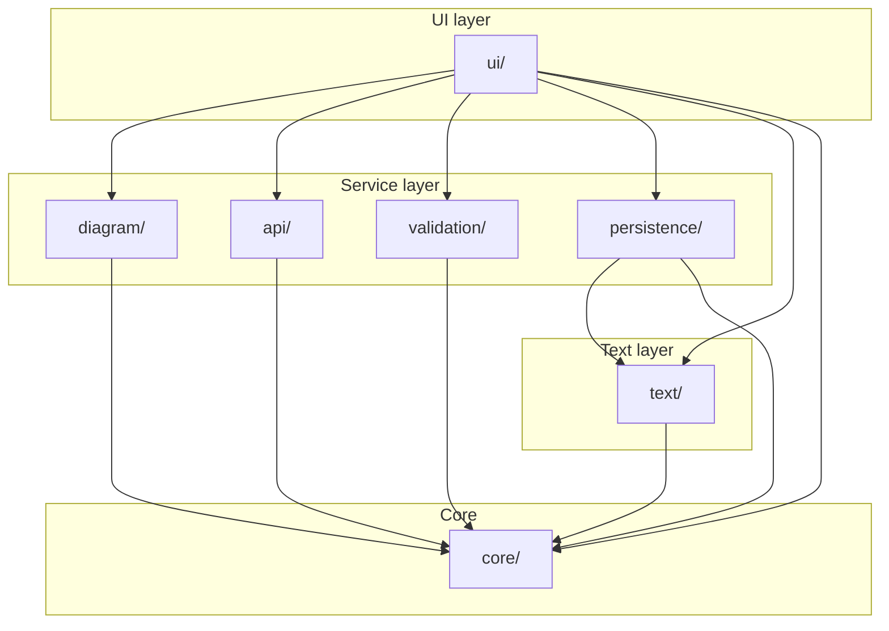
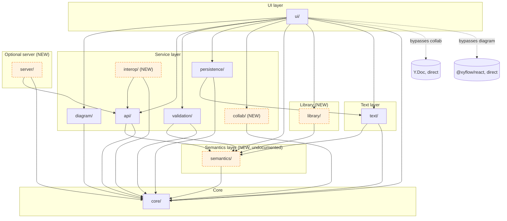

# 04 — Module Dependency Graph (Documented vs Actual)

The original plan (`03-architecture-and-plan.md` §2, §4) specifies a
**dependency-acyclic** layering in which every module depends only on `core`,
siblings are reached only via their public `index.ts`, and four features
(collab, full stdlib, sequence/geometry/parametric views, OSLC, multi-user
server) are explicitly **out of scope**. This page contrasts that intent with
what the code actually does.

## Documented layering (intent)

**Plan invariants:** acyclic; `core` is the only depended-upon layer; siblings
via `index.ts`; 7 modules only.

## Actual layering (as-built)

**Drift summary:** 5 entirely new modules (`semantics`, `library`, `collab`,
`interop`, `server`); 2 new cross-cutting concerns shown dotted (Yjs &
React-Flow bypassing their encapsulating modules); and a new dependency edge
`api → semantics` that the documented graph does not show.

## Cycles

**None.** `madge --circular` over every module's entry returns clean. The
acyclicity claim in the plan is genuinely honoured at the file level. ✅

## Deep-import violations of the "siblings via `index.ts`" rule

The plan says siblings must be reached via their public `index.ts`. The code
violates this in **~11 production sites** plus many test files. The
`tsconfig.json`/`vite.config.ts` path aliases cover only **7 of 13** src
modules (no alias for `@semantics`, `@library`, `@collab`, `@interop`,
`@server`), so consumers have no choice but to deep-import.

| Evidence (production) | What it bypasses |
|---|---|
| `src/server/app.ts:23` `from '@api/rest'` | `@api/index` barrel |
| `src/server/app.ts:24` `from '@api/oslc'` | `@api/index` barrel |
| `src/collab/provider.ts:18` `from '../core/metamodel'` | `@core/index` |
| `src/collab/model-doc.ts:28` `from '../core/model'` | `@core/index` |
| `src/collab/model-doc.ts:29` `from '../core/metamodel'` | `@core/index` |
| `src/api/sdk.ts:28-29` `from '../semantics/units'`, `'../semantics/units-eval'` | `../semantics/index` |
| `src/api/analytics.ts:28-29` same pair | `../semantics/index` |
| `src/semantics/featuring.ts:34` `from '../library/resolve'` | `../library/index` |
| `src/ui/store.ts:80` `from '../library/resolve'` | `../library/index` |
| `src/ui/panels/Properties.tsx:24` `from '../../semantics/units'` | `../semantics/index` (and 3 dirs up) |

## Scope drift catalog

The plan (`03-architecture-and-plan.md:142`) explicitly lists as **OUT OF
SCOPE**: *"real-time CRDT collaboration, full standard library import,
Sequence/Geometry/Parametric views, OSLC, multi-user server."* Every one ships.

| Module / file | In plan module map? | Was "out of scope"? | Drift risk |
|---|:-:|:-:|---|
| `src/semantics/` (17 files, ~11 k LOC) | ❌ | — | **Critical** — undocumented layer; `api/` silently depends on it |
| `src/library/` + 8 MB stdlib JSON | ❌ | "full stdlib import" | **Critical** — full library is the *default* loader (`src/library/index.ts:64-81`) |
| `src/collab/` (3 files) | ❌ | "real-time CRDT collab" | **Critical** — Yjs + y-websocket + awareness shipped |
| `src/server/` (4 files, ~2.6 k LOC) | ❌ | "multi-user server" | **Critical** — Express app + OpenAPI + OSLC + RDF |
| `src/interop/` (2 files) | ❌ | not mentioned | High — OMG pilot integration client |
| `src/api/oslc.ts` (335 LOC) | ❌ | "OSLC" | High — undocumented OSLC PSM facade |
| `src/api/versioning.ts` (~600 LOC) | ❌ | — | High — entire git-like Project/Branch/Commit/Tag layer |
| `src/api/element-graph-schema.ts` (~125 LOC) | ❌ | — | Medium — JSON-Schema validator; pulls `ajv` (a production `dependency`) |
| `src/api/request-schemas.ts` (~145 LOC) | ❌ | — | Low — `ajv` inbound-body validators (finding H1); imported by `rest.ts` on the live request path, not re-exported from `@api/index` |
| `src/diagram/sequence.ts` + `SequenceView.tsx` | ❌ | "Sequence views" | High |
| `src/diagram/geometry3d.ts` + `Geometry3DView.tsx` | ❌ | "Geometry views" | High (pulls `three`) |
| `src/diagram/matrix.ts`, `MatrixView.tsx`, `grid.ts`, `GridView.tsx` | ❌ | — | Medium |
| `src/diagram/build.ts` parametric/case/allocation branches | ❌ | "Parametric views" | High — `ViewKind` is now 12 variants, not the 6 in plan §4 |
| `src/ui/panels/Collaborate.tsx` | ❌ | collab | High |
| `scripts/collab-server.ts` | ❌ | "multi-user server" | High |

**Net drift:** the codebase contains **~12 k+ LOC** in modules that did not
exist when the plan was written. The README and `docs/FEATURE-PARITY.md`
already market six of these as headline features; the architecture document
has not been revised to match.

## Abstraction leaks & contract drift

- **The "PURE" `svg-export.ts` transitively pulls React + `@xyflow/react`**
  through `src/diagram/svg-export.ts:21` → `./edges` (a `.tsx` file). The
  "PURE function (no DOM, no React, no React Flow)" header at line 5 is false.
- **`diagram/index.ts` re-exports React components** (`MatrixView`,
  `SequenceView`, `GridView` at lines 55-59), so any consumer of `buildDiagram`
  or `svgFromDiagram` transitively type-pulls React.
- **`ajv` is a production `dependency`** (`package.json:25`), imported by two
  source files: `src/api/request-schemas.ts:13` (finding H1's inbound-body
  validators, on the live `rest.ts` request path) and
  `src/api/element-graph-schema.ts:29`. The element-graph-schema validator is
  still *not* re-exported from `@api/index` — it is orphaned, reachable only via
  deep-import from one test.
- **Two parallel OMG `ProjectResource`/`BranchResource`/`CommitResource`
  definitions** — one in `src/api/rest.ts:51`, one in `src/interop/pilot-client.ts:32` —
  with no shared base type.
- **Two sources of truth for the metaclass lattice:** `core/metamodel.ts:77-216`
  (predicates + catalogues) and `semantics/metaclasses.ts` (re-encodes the same
  lattice as data with supertype edges).

## Public contract conformance (vs plan §4)

| Contract | Plan §4 shape | Actual | Conforms? |
|---|---|---|:-:|
| `ParseResult` / `ParseDiagnostic` | `{ model, diagnostics }` / `{ message, line, column, severity }` | `src/text/parser.ts:33-44` | ✅ exact |
| `Diagnostic` | `{ id, ruleId, severity, message, elementId? }` | `src/validation/types.ts:19-30` | ✅ additive `id` |
| `DiagramNode/Edge/Graph` | per plan | `src/diagram/types.ts:40-82` | ✅ exact |
| `QueryResult` | `{ commitId, elements, total }` | `src/api/query.ts:105-111` | ✅ additive `nextCursor?` |

Contracts are stable and only grew additively. The drift is in *module
topology*, not in the cross-module data shapes.

> **2026-09-02 — edge reversed.** `findLibraryType`/`libraryNameIndex` moved from
> `src/library/resolve.ts` into `src/core/scope.ts` (they are pure `Model` walks with no
> library-data dependency). The two `semantics → library` edges that carried them are gone;
> `src/library/resolve.ts` now imports `resolveName` from `@semantics/resolve-names` so the
> binder can compose KerML full resolution. `library → semantics → core` is acyclic. (The
> older note that there is "no alias for `@semantics`, `@library`" is stale — both exist in
> `tsconfig.json`, `vite.config.ts` and `vitest.config.ts`.)

> **2026-09-03 — one resolver, and a new `text → semantics` edge.**
> `src/semantics/bind.ts` is THE reference resolver (`resolveFullName`,
> `resolveRedefinedFeature`, `resolveImportTargets`). It composes `resolveName`
> (per-namespace: owned + alias, inherited, imported) with the outward walk and
> the containment/qualified fallbacks, and it is deliberately LIBRARY-FREE — it
> imports `@core/index` and its two semantics siblings and nothing else — so the
> textual mapper can call it INSIDE `parseModel` without pulling the multi-MB
> library bundle onto the parse path. `src/text/langium/map-to-model.ts` and
> `src/text/serializer.ts` now import it, which adds the `text → semantics` edge
> shown above; `src/library/resolve.ts` and `src/validation/rules.ts` call the
> same functions instead of their own private walks. The layering stays acyclic
> (`text → semantics → core`, `library → semantics → core`), and the splitter
> the mapper used to own (`unquoteName`/`splitQualified`/`refSegments`) moved
> down to `src/core/names.ts` so every layer cuts a qualified name the same way.
