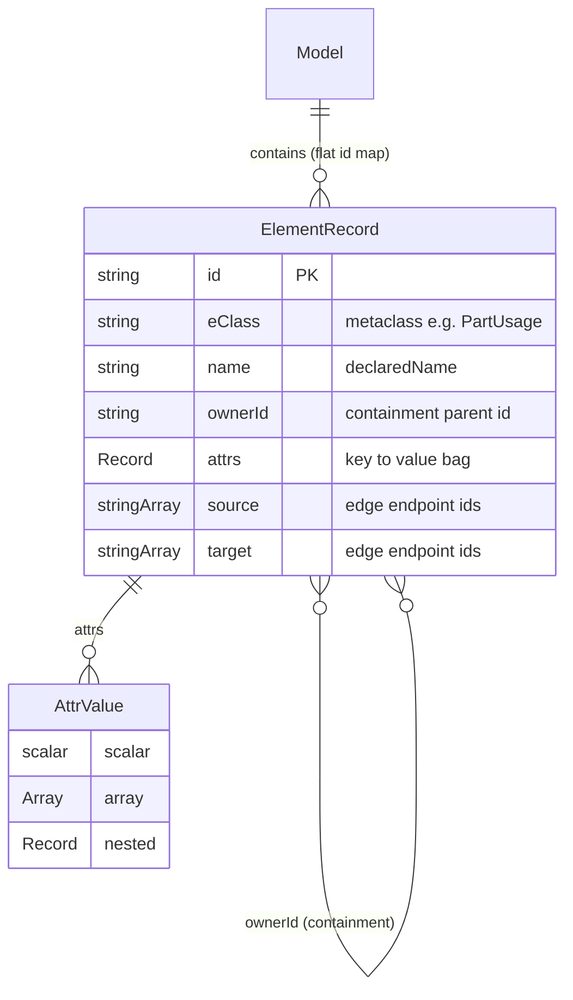
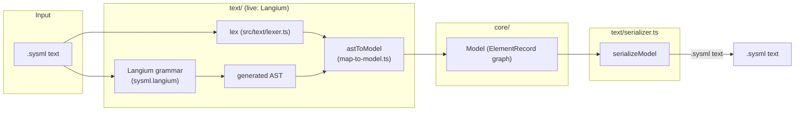
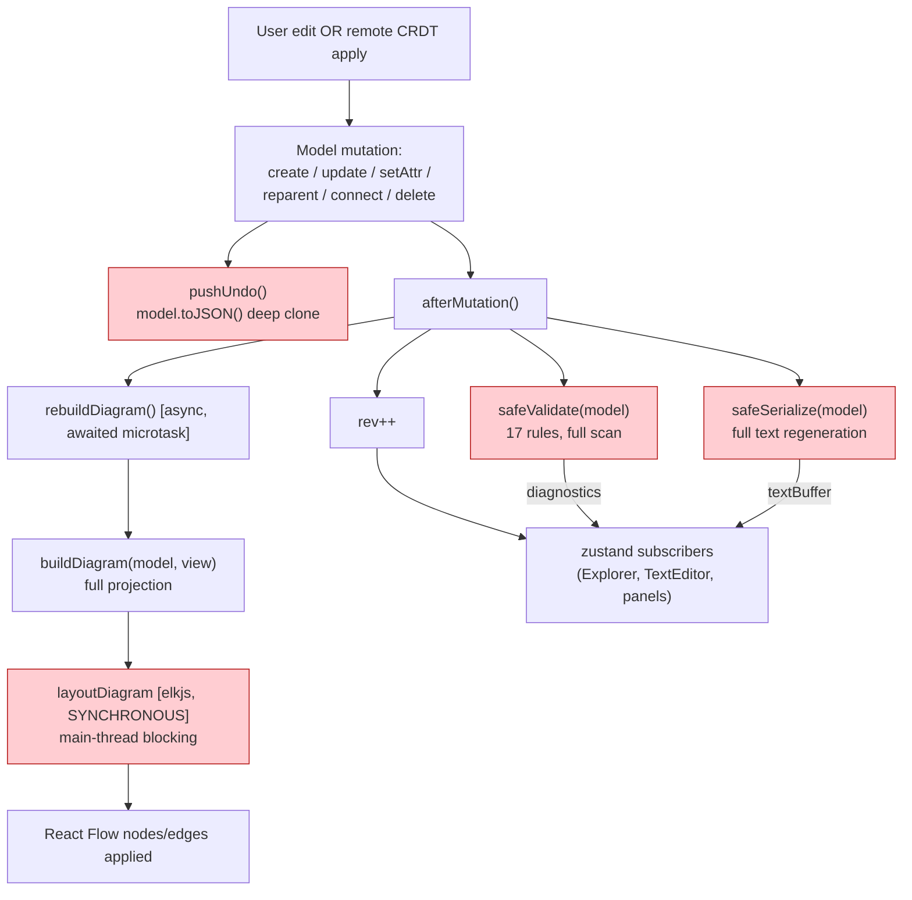
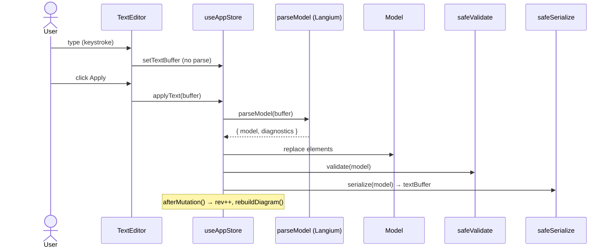
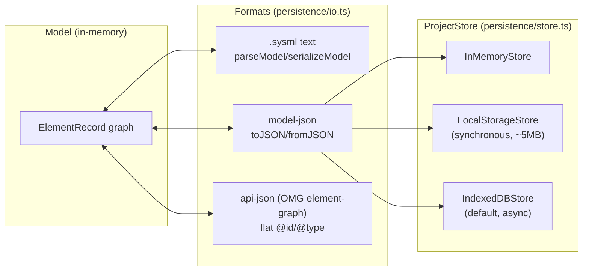
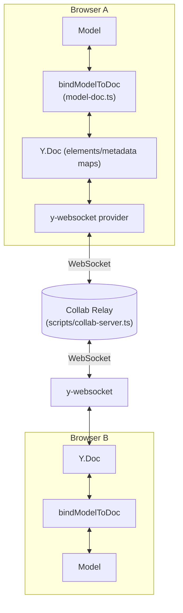
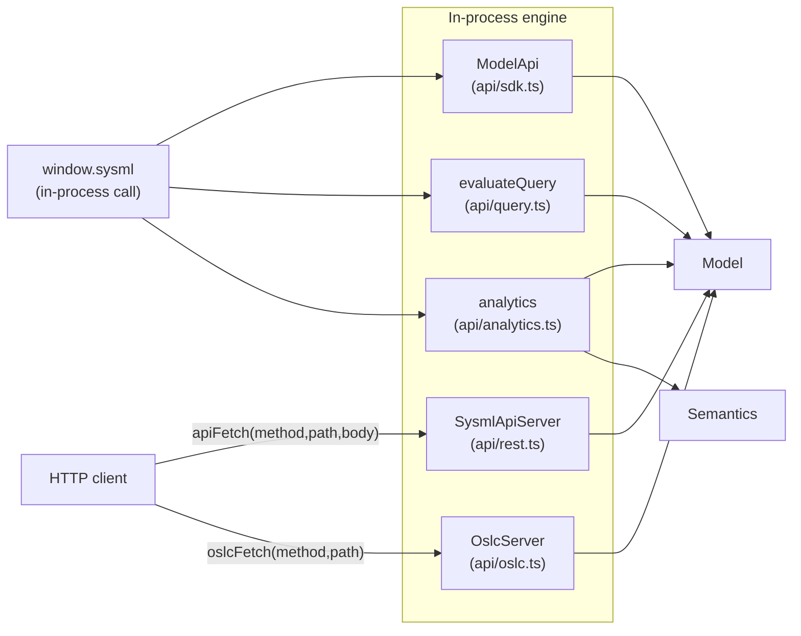

# 05 — Data Flow & Model Shape

This page describes how data moves through the modeler: the in-memory
metamodel, the parse↔serialize round-trip, the mutation pipeline that keeps
the views in sync, and the import/export projections.

## In-memory metamodel

- **Uniform shape.** Every node and every relationship is an `ElementRecord`
  (`src/core/metamodel.ts`). Relationships are *reified* as first-class
  elements with `source`/`target` id arrays, not as pointers.
- **Flat id map.** `Model.elements: Map<string, ElementRecord>`; containment
  is encoded via `ownerId`, not via nested objects.
- **OMG element-graph alignment.** The shape mirrors the OMG SysML v2 API
  element-graph (`@id`/`@type`/`owningRelationship`), so the JSON form
  round-trips losslessly *at the data-model level* (textual round-trip has
  known gaps — see `08 §A`).

## Parse ↔ Serialize round-trip

- **Live parser:** Langium grammar → generated AST → `astToModel` mapper,
  exported as `parseModel` (`src/text/index.ts:18`).
- **Forward / cross-scope refs** get a second resolution pass:
  `Mapper.resolveDeferredRefs()` (`src/text/langium/map-to-model.ts`), run once at
  the end of the forward-order build, re-resolves endpoint (`sourceRef`/`targetRef`),
  `aliasFor`, and node-level specialization-array refs whose targets were declared
  later or in a sibling scope. It deliberately EXCLUDES `typeRef`/`attrs.type`,
  which stay the responsibility of `resolveTypeReferences` (`src/library/resolve.ts`).
- **Serializer:** `serializeModel` walks the containment tree and emits
  indented SysML v2 textual notation.
- **Round-trip fidelity is NOT byte-exact** (the serializer reformats), but the
  forms this doc once listed as dropped now round-trip: `:=` (initial value);
  a trailing constraint/calc `attrs.expression` (emitted after the body members);
  `#metadata` prefixes and `@`-annotations (`MetadataUsage`); import `filters`;
  `visibility`; and `ordered`/`nonunique` modifiers, plus non-identifier name
  quoting. Remaining known gaps are in `08 §A` (e.g. `InitialNode`/`DoneNode`
  still emit no valid keyword).

## Mutation pipeline (the "afterMutation" fan-out)

This is the hottest path in the app and the source of the most severe
performance findings (`08 §B`/`§D`).

- **Debounced diagram rebuild.** `afterMutation` (`src/ui/store.ts:569-578`) runs
  `safeValidate` + `safeSerialize` synchronously per mutation, then coalesces the
  diagram rebuild behind an 80 ms debounce (`REBUILD_DEBOUNCE_MS`/`scheduleRebuild`,
  `src/ui/store.ts:544-552`) so a burst of edits triggers one ELK layout. A single
  `setAttr` (e.g. typing in Properties) still re-validates and re-serializes the
  whole model.
- **ELK is the synchronous bundled build** (`src/diagram/layout.ts:15`), so the
  `await` only defers a microtask; the layout CPU is on the main thread.
- **`pushUndo` retains up to 50 full deep clones** (`UNDO_LIMIT = 50`) → memory
  wall on large models.
- **Caches are not invalidated.** `semantics/resolve-names.ts` and
  `featuring.ts` keep `WeakMap<Model, Map>` caches across mutations → stale
  results after renames (a correctness bug, `08 §F`).

## Text-edit pipeline (the other direction)

- Typing does **not** parse — only the explicit "Apply" does (`src/ui/store.ts:918-941`).
- `parseModel` is whole-document; there is **no incremental parsing**.

## Persistence & import/export projections

- `importModel` accepts any of the three formats; `exportModel` emits any.
- `createDefaultStore` prefers IndexedDB, falls back to localStorage, then
  in-memory.
- `JSON.parse` on import is wrapped (`parseJson`, `persistence/io.ts`) so a
  malformed/truncated file throws a clear `ImportError`, not an uncaught
  `SyntaxError`; the parsed value is then structurally checked
  (`isSerializedModel`/`isApiGraph` require an `elements` array) but not against
  the full element-graph schema (`08 §C`).

## Collaboration data flow

- The `Model` ↔ `Y.Doc` binding (`src/collab/model-doc.ts`) two-way-syncs
  element maps and translates `ChangeEvent`s into CRDT updates and vice-versa.
- The relay is a pure relay — it holds per-room docs and broadcasts. It has
  **no authentication** and binds loopback (`127.0.0.1`) by default (`HOST`), but
  it now enforces an Origin allowlist (`COLLAB_ALLOW_ORIGIN`), a 10 MiB
  `maxPayload`, and room/connection caps (`COLLAB_MAX_ROOMS` 512 /
  `COLLAB_MAX_CONNS_PER_ROOM` 256), refusing excess with WS 1013 (finding M4).

## Analytics / Query / REST flow

- `window.sysml` calls the engine in-process; the Express server is a thin
  translation layer over the same `SysmlApiServer` / `OslcServer` facades.
- `analytics` and `query` both consult `semantics` (units, evaluation,
  conformance) — the undeclared dependency edge shown in `04`.
- **Inbound REST bodies are validated (finding H1).** Every mutating handler in
  `api/rest.ts` checks `req.body` against an ajv schema (`api/request-schemas.ts`)
  and returns `400` on a malformed body; the Express layer (`server/app.ts`) wraps
  each `apiFetch` in try/catch → `500` (never a hung request), and a non-string
  query `property` path no longer throws (`getProperty`, `api/query.ts`).
