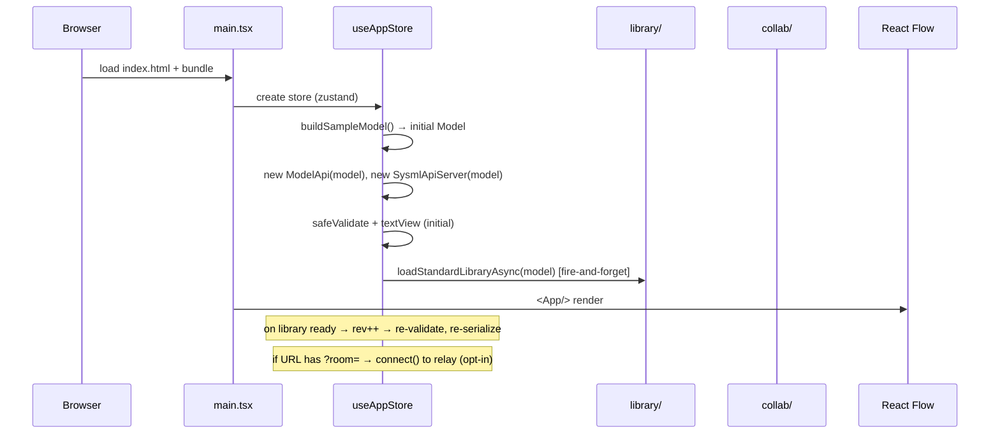
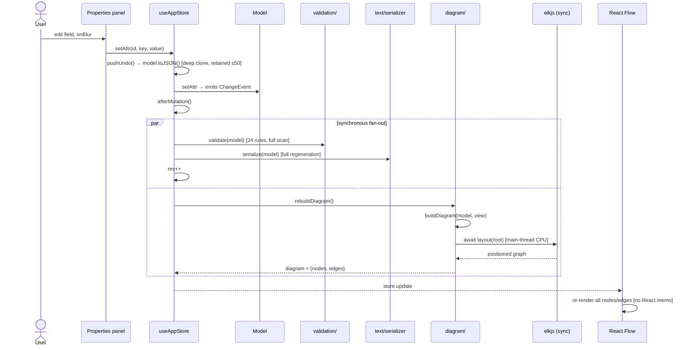
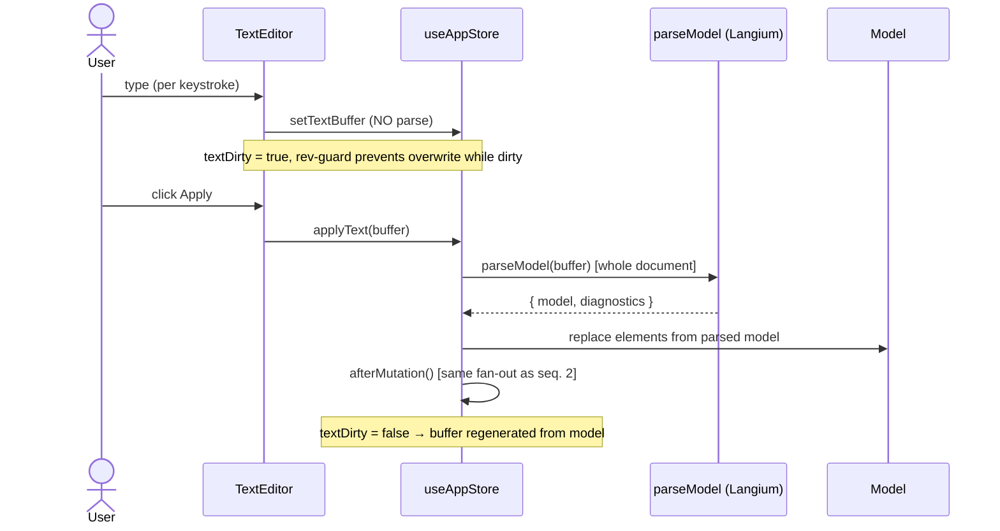
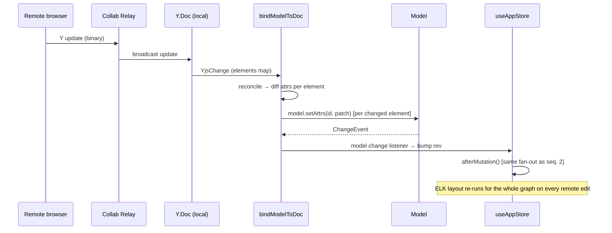
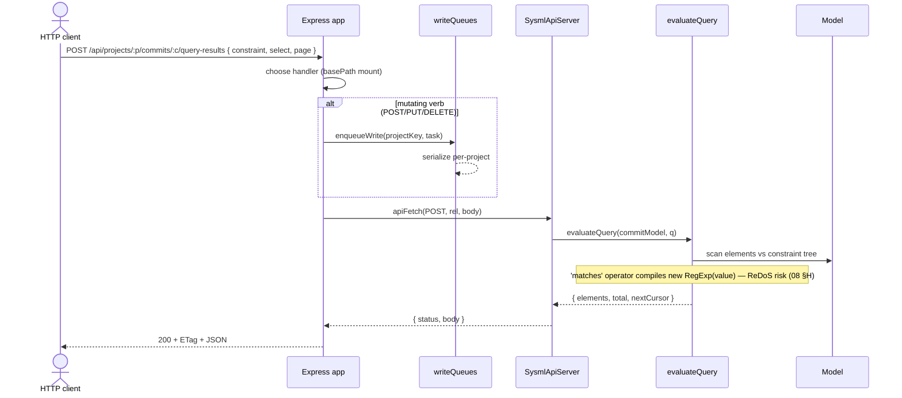
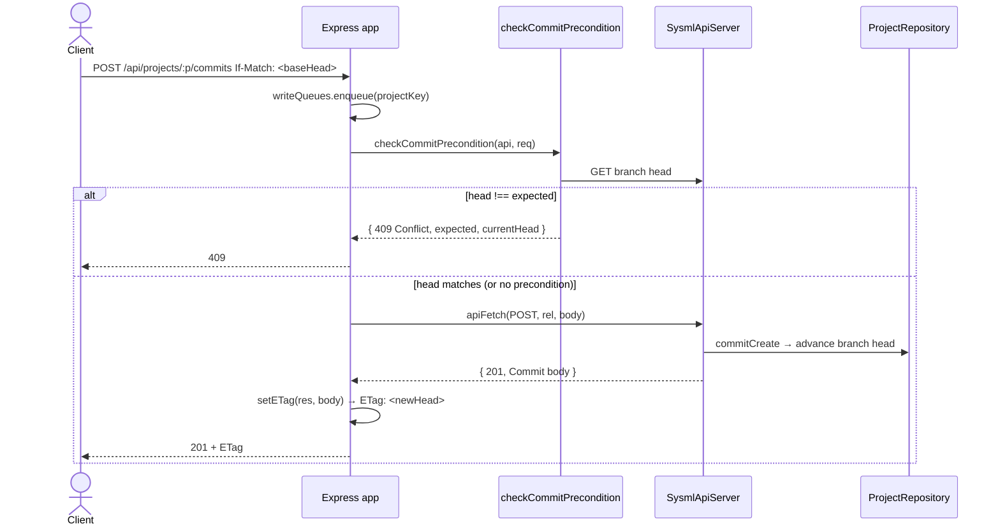
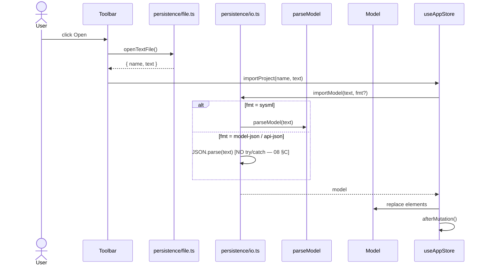
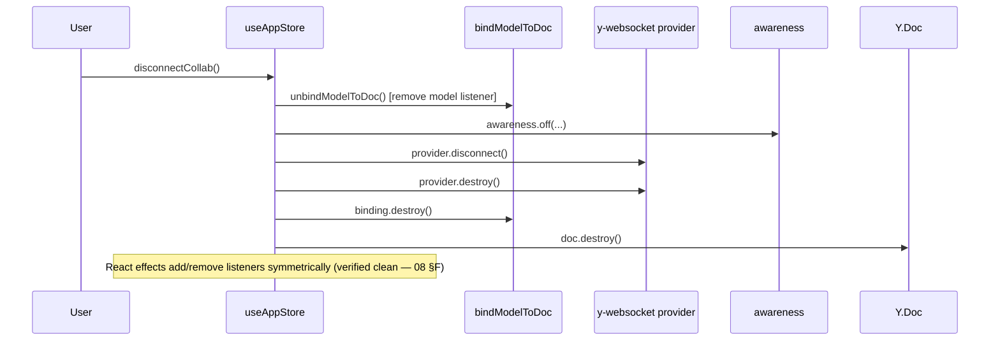

# 06 — Sequence Diagrams

Key runtime sequences. All are grounded in the as-built code; line references
point to the implementation.

## 1. App bootstrap

## 2. Graphical edit → diagram rebuild (hot path)

**Why this matters:** every keystroke-equivalent edit triggers a full
validation pass, a full text regeneration, and a synchronous ELK layout of the
entire graph. There is no debounce. Documented in `08 §B`/`§D`.

## 3. Text edit → model (apply)

## 4. Remote CRDT apply (collab)

## 5. REST query (optional server)

## 6. Commit with optimistic concurrency

## 7. Import file

## 8. Disconnect collab / teardown

