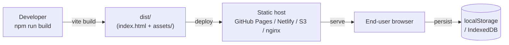
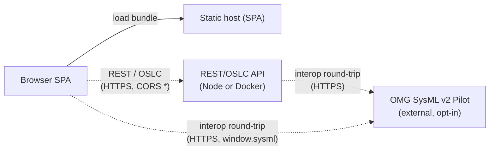
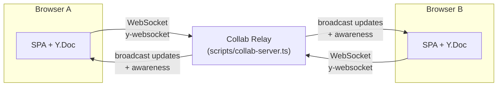
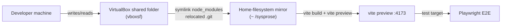

# 07 — Deployment View

The modeler is **static-hostable by design**. The optional REST API and collab
relay are independent deployment units that can be added when automation,
integration, or multiplayer is required.

## Topology A — Pure static (default, zero backend)



- `vite.config.ts` uses `base: './'`, so the bundle runs on any host path.
- GitHub Actions workflow (`.github/workflows/deploy-pages.yml`) builds and
  deploys on push to `main`.
- All persistence is local to the browser; no server round-trip is needed for
  any core authoring feature.

## Topology B — Static SPA + optional REST/OSLC API



Two ways to run the API:

```bash
# Direct (Node)
npm run serve               # src/server/index.ts, default port 5178

# Containerized
docker build -t sysmlv2-api .
docker run -p 5178:5178 sysmlv2-api
# OpenAPI at http://localhost:5178/openapi.json
# Docs    at http://localhost:5178/docs
```

**Caveats (see `08 §I`):**

- The server binds to `127.0.0.1` (loopback) by default (set `HOST=0.0.0.0`, as the `Dockerfile` does, to expose it) and has **no authentication layer**.
- CORS defaults to wildcard (`*`) but is a configurable allowlist via `CORS_ORIGINS` (comma-separated; a matching request `Origin` is then reflected instead of `*`).
- The `Dockerfile` drops privileges to the image's non-root `node` user (`USER node`).
- Baseline hardening headers are set (`X-Content-Type-Options: nosniff`, `X-Frame-Options: DENY`, `Referrer-Policy: no-referrer`), though no `helmet`/CSP.

These are acceptable for a local-only or trusted-network deployment; they are
**not** safe to expose to the public internet without a reverse proxy that
adds auth, TLS, and rate limiting.

## Topology C — Multiplayer (SPA + collab relay)



```bash
npm run collab              # scripts/collab-server.ts, default port 1234
```

**Caveats (see `08 §E`):**

- The relay still has **no authentication** — any client that clears the Origin
  check can join any room and mutate the shared doc — but it is no longer wide
  open: a `verifyClient` **Origin allowlist** (`COLLAB_ALLOW_ORIGIN`,
  comma-separated; when unset, all browser Origins are allowed and non-browser
  clients always are), a **`maxPayload` of 10 MiB** per frame, and
  **room/connection caps** (`COLLAB_MAX_ROOMS`, default 512;
  `COLLAB_MAX_CONNS_PER_ROOM`, default 256 — excess refused with WS close 1013)
  now bound the exposure.
- Default host is `127.0.0.1` (loopback); set `HOST=0.0.0.0` to expose it.
- Rooms live until their last connection closes (no idle eviction).

## Topology D — Local development



Per `README.md`: vboxsf breaks the dev server's file-watching, so the project
uses `vite build` + `vite preview` for running the app. The Vitest/Playwright
config reflects this (`playwright.config.ts:5-7` notes the workaround).

## Build & artifact map

| Artifact | Producer | Notes |
|---|---|---|
| `dist/index.html` + `dist/assets/*.js` | `vite build` | Main chunk ≈ **2.6 MB** (React + React Flow + elkjs + Yjs, not split) |
| `dist/assets/Geometry3DView-*.js` (~541 KB) | dynamic `import()` | Three.js, lazy-loaded only when the 3D geometry view opens |
| `dist/assets/stdlib-*.json` (~8.2 MB) | Vite asset import | Standard library data, fetched at runtime |
| `dist/assets/full-library-*.js` (~5 KB) | dynamic `import()` | Library loader, lazy |
| `Dockerfile` | `docker build` | Node 22 slim, runs the Express API (not the SPA) |

**Build hygiene gaps (`08 §I`/performance review):**

- `vite.config.ts` has **no `manualChunks`** — elkjs, React Flow, and Yjs all
  land in the entry chunk and parse/execute on first paint.
- `emptyOutDir` is not set, so `dist/assets/` accumulates stale chunks across
  builds (~50 observed).

## CI / GitHub Actions

`.github/workflows/deploy-pages.yml` builds the SPA and deploys to GitHub
Pages on push to `main`. No workflow currently runs `npm test` or
`npm run typecheck` as a gate (`08 §L` — no ESLint config either).
